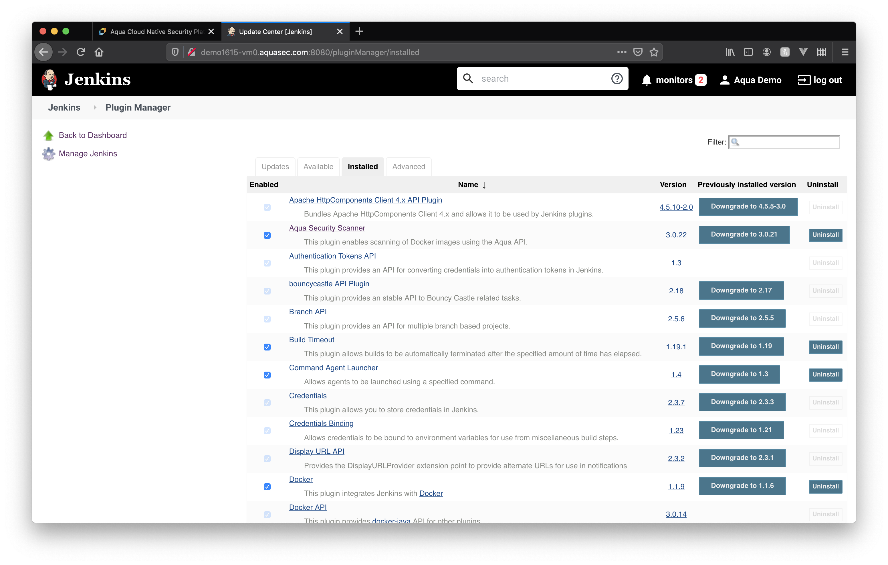

# Aqua CI/CD Example

[](https://circleci.com/gh/sanjay-shah/aqua-ci-example)

## CircleCI integration with Aqua Scanner

CircleCI pipeline [config.yml](./.circleci/config.yml) example.

## Jenkins integration with Aqua Scanner

Jenkin pipeline [Jenkinsfile](./Jenkinsfile) example.

Jenkins Aqua Security Scanner Plugin [configurations](#jenkins-aqua-security-scanner-plugin)

## Universal setps for any CI/CD Pipeline without Aqua Plugin
```shell

##############################
# STEP 1: DOCKER BUILD IMAGE #
##############################
docker build -t aqua-ci-example:${CIRCLE_SHA1} .

##############################################
# STEP 2: DOCKER LOGIN AND PULL AQUA SCANNER #
##############################################
docker login registry.aquasec.com \
-u ${AQUA_USER} -p ${AQUA_PASSWORD} \
&& docker pull registry.aquasec.com/scanner:5.3

##############################################
# STEP 3: SCAN BUILT IMAGE WITH AQUA SCANNER #
##############################################
docker run -e BUILD_JOB_NAME=${CIRCLE_BUILD_URL} \
-e BUILD_NUMBER=${CIRCLE_BUILD_NUM} \
--rm -v /var/run/docker.sock:/var/run/docker.sock \
registry.aquasec.com/scanner:5.3 scan \
--host=${AQUA_CONSOLE} \
--user=${AQUA_SCANNER_USER} \
--password=${AQUA_SCANNER_PASSWORD} \
--no-verify --verbose-errors --local \
aqua-ci-example:${CIRCLE_SHA1}

#############################
# STEP 4: DOCKER PUSH IMAGE #
#############################
docker push [OPTIONS] NAME[:TAG]
```

## Jenkins Aqua Security Scanner Plugin

### Install Aqua Security Scanner Plugin for Jenkins



### Configure Aqua Security Scanner Plugin for Jenkins


